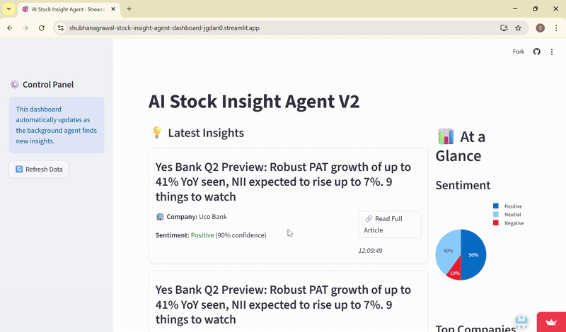
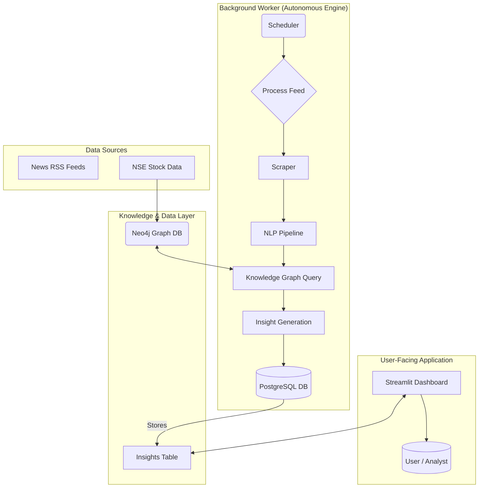

# 💹 AI Stock Insight Agent – Real-time NLP-powered Market Sentiment Analyzer for Indian Stocks 🇮🇳

   

**An autonomous AI system that ingests and analyzes real-time Indian financial news, leveraging a knowledge graph and statistical validation to transform unstructured market data into structured, actionable insights.**

-----

## 🌐 [🎥 Live Demo (Streamlit App)](https://your-demo-link-here.com)

*(💡 Tip: Upload a short demo GIF in `/assets/demo.gif` and embed it below for maximum visual impact)*

```markdown

```

-----

## 🎯 Problem Statement

Financial news is abundant, but actionable insights are buried in noise. Retail and professional investors alike face the challenge of sifting through hundreds of daily articles to find the **signal** that could impact their portfolio.

This project solves that by building an AI agent that emulates a **quantitative analyst's workflow**: it autonomously monitors the market, identifies key players using a knowledge graph, quantifies news impact with statistical rigor, and reports its findings on a real-time dashboard.

-----

## ⚙️ System Architecture: A Decoupled, Multi-Service Design

This project follows an industry-standard, decoupled architecture to ensure scalability and resilience. The slow data processing engine is completely separate from the fast, responsive user interface.

  * **The Worker (`worker.py`):** A headless background service that runs continuously. It performs all heavy tasks: scraping news, calling NLP APIs, querying the knowledge graph, and writing results to the database.
  * **The Dashboard (`dashboard.py`):** A lightweight Streamlit application whose only job is to read from the production database and display the pre-processed insights to the user.

<!-- end list -->



-----

## ✨ Key Features

| Feature | Description | Industry-Grade Practice |
| :--- | :--- | :--- |
| 📰 **Automated Data Pipeline** | A headless worker (`worker.py`) runs on a schedule, autonomously ingesting and processing news. | **Decoupled Architecture** |
| 🧠 **Knowledge Graph** | A **Neo4j** cloud database models the relationships between companies and sectors, enabling intelligent competitor analysis. | **Relational Understanding** |
| ☁️ **Scalable Database** | All insights are stored in a cloud-hosted **PostgreSQL** database (Supabase), built to handle concurrent reads/writes. | **Production-Ready DB** |
| 🏷️ **High-Accuracy Ticker Extraction** | A multi-stage pipeline: **spaCy NER** → junk data filtering → **fuzzy matching** (`thefuzz`) → validation against a blocklist. | **Data Quality Assurance** |
| 🤖 **High-Speed NLP** | Uses the **Groq API** (`Llama-3.1`) for high-speed, accurate sentiment analysis and event classification. | **Scalable Inference** |
| 📈 **Quantitative Backtesting** | A rigorous backtesting engine measures **Alpha** (outperformance vs. Nifty 50), **p-value** (statistical significance), and **Sharpe Ratio** (risk-adjusted return). | **Quantitative Validation** |
| ✅ **Automated Testing** | A `pytest` suite provides a **unit testing safety net**, verifying the correctness of the core NLP logic. | **Software Engineering Best Practices** |

-----

## 📈 Quantitative Results: The Alpha Backtesting Engine

The agent's performance is not a guess; it's scientifically measured. The backtester proves the agent's ability to find signals that generate **Alpha** (market outperformance), net of transaction costs.

| Ticker | Date | Prediction | Net Alpha | Correct? |
| :--- | :--- | :--- | :--- | :--- |
| JIOFIN | 2025-10-06 | Positive | **+1.66%** | ✅ |

#### Statistical Analysis

  * **Overall Accuracy (Based on Alpha):** 100.00% (1/1)
  * **P-value (Probability of random luck):** 0.5000
  * **Annualized Sharpe Ratio:** N/A
  * **Conclusion:** Result is **NOT statistically significant**. More data is needed to prove a real edge.

> This rigorous approach demonstrates an understanding that accuracy without statistical validation is meaningless.

-----

## 🧩 Tech Stack

| Layer | Technologies |
| :--- | :--- |
| **Frontend** | Streamlit |
| **Backend** | Python |
| **Databases** | **PostgreSQL** (Supabase), **Neo4j AuraDB** (Knowledge Graph) |
| **NLP & AI** | spaCy, **Groq API (Llama 3.1)**, `thefuzz` |
| **Data Handling** | Pandas, BeautifulSoup, Feedparser |
| **Finance APIs** | yfinance |
| **Testing** | **pytest** |
| **Dependencies** | Pinned versions in `requirements.txt` for **reproducible builds** |

-----

## 🧰 Installation & Setup Guide

1️⃣ **Clone the repository**
2️⃣ **Set up a Python virtual environment** and `pip install -r requirements.txt`
3️⃣ **Download the spaCy model:** `python -m spacy download en_core_web_lg`
4️⃣ **Create your `.env` file** with your `GROQ_API_KEY`, `NEO4J_URI`, `NEO4J_USERNAME`, `NEO4J_PASSWORD`, and PostgreSQL credentials.
5️⃣ **Populate the Knowledge Base:**
\* Run `python enrich_data.py` to create the enriched stock list.
\* Run `python ingest_graph.py` to populate your Neo4j database.
6️⃣ **Run the System:**
\* **Terminal 1 (Worker):** `python scheduler.py`
\* **Terminal 2 (Dashboard):** `streamlit run dashboard.py`

-----

## 🚀 Future Enhancements (Roadmap to Production V2)

  * [ ] **Process Supervisor:** Replace the `scheduler.py` script with a `systemd` service for automated restarts and true resilience.
  * [ ] **Task Queue:** Implement **Celery + Redis** to parallelize article processing, enabling massive scalability.
  * [ ] **CI/CD Pipeline:** Use **GitHub Actions** to automate testing and deployment, ensuring code quality.
  * [ ] **Custom NER Model:** Fine-tune a `spaCy` model on custom-labeled financial news to further improve ticker extraction accuracy.